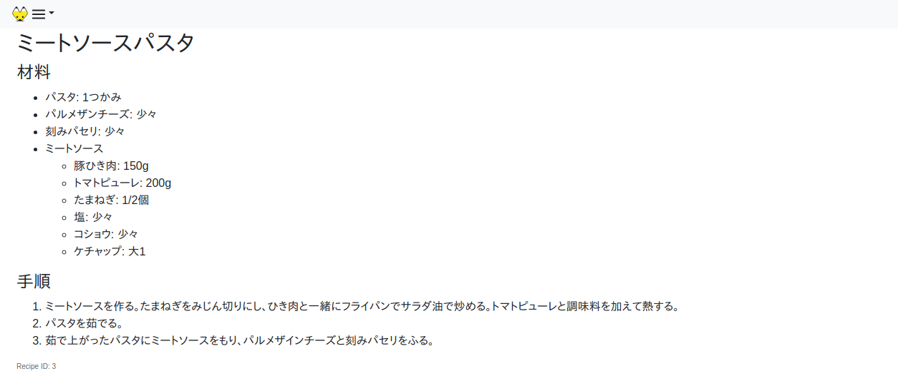

# kon-board - simple Web-based meal calendar

kon-board is a personal Web application that manages meal plans and recipes.

At the top page, it shows calendar with meal plans.

(For now, **only Japanese locale** is supported)

You can see the meal calendar [as a table](screenshots/shot_caltable.png) as well as a list.

You can see the recipes for meals in the calendar.

## Contents

- [Run](#run)
- [Add recipes](#add-recipes)
- [Add meal plans](#add-meal-plans)
- [Development](#development)
- [Recent changes](#recent-changes)

## Run

Just install [docker-compose](https://docs.docker.com/compose/) and run the pre-built Docker image.

    $ docker-compose up

And then, access http://localhost:8888/ with your Web browser.

See the [Docker Hub](https://hub.docker.com/r/debugito/kon-board/tags) for available Docker images. Tags with `-armv7l` are built on Raspberry Pi 4 Model B.

## Add recipes

Write recipes in YAML format. kon-board reads all YAML files under `recipes` directory for recipes.

See [the example of recipe YAML](kon-board/test/recipes/recipe_example.yaml) for detail.

You have to restart the server when you update the recipe or meal plan YAML files.

## Add meal plans

A meal plan is what you eat (or ate) on a specific date.

Currently, kon-board is mainly designed for planning lunch and dinner.
It also supports planning breakfast and other meals (like snacks), but they are optional.

You can also add notes on meal plans, such as temporary modification to the recipes and TODOs about the meal plan.

Write meal plans also in YAML format. kon-board reads all YAML files under `meal-plans` directory for meal plans.

For now, kon-board doesn't support editing meal plans on the Web interface.

See [the example of meal plan YAML](kon-board/test/meal-plans/plan_example.yaml) for detail.

## Development

### Content

Content of this repository is:

- kon-board: Haskell library about kon-board data models and storage.
- kon-board-gen-elm: Haskell program to generate Elm code about data models.
- kon-board-server: Haskell program of the backend server.
- kon-elm: Elm program of the Web frontend application.
- static: Static files served by the backend server.

### Build

This project builds the backend with

- ghc-8.8.4
- cabal-install-3.0.0.0
- the cabal.project.freeze file commited in the repository

This is because we want to build the project with the GHC packaged for Debian GNU/Linux 11 (bullseye).
This makes it easy to build the backend in Raspberry Pi.

For frontend, we [Elm 0.19](https://elm-lang.org/) compiler.

#### Backend server

To build the backend server, run

    $ make backend

#### Frontend application

To build the frontend application, run

    $ make frontend

This will generate `static/main.js`, the JavaScript application built from Elm source files in kon-elm.

The Elm program requires some Elm code generated by the Haskell program under kon-board, so `make frontend` also builds the Haskell program.

To build the backend and frontend, just run `make`.

#### Backend Docker image

To build the Docker image, run

    $ make frontend
    $ docker build .

Note:

- You need to build the frontend outside the Docker container. The Dockerfile will copy the pre-built main.js into the container. This is because there is no release of Elm compiler for ARM.

### Run

In development, run the following after you build the backend and frontend.

    $ stack run kon-board-server

## Recent changes

See [ChangeLog.md](kon-board/ChangeLog.md).

## Author

Toshio Ito <debug.ito@gmail.com>
