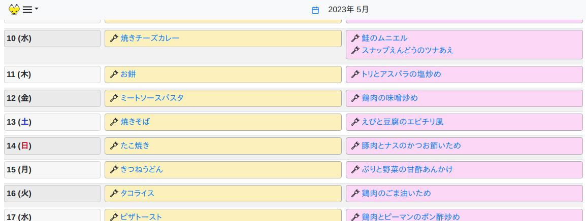

# kon-board - simple Web-based meal calendar

kon-board is a personal Web application that manages meal plans and recipes.

At the top page, it shows calendar with upcoming meal plans.

(For now, **only Japanese locale** is supported)

You can see the recipes for meals in the calendar.

## Run

Just install [docker-compose](https://docs.docker.com/compose/) and run the pre-built Docker image.

    $ docker-compose up

See the [Docker Hub](https://hub.docker.com/repository/docker/debugito/kon-board) for available Docker images. Tags with `-armv7l` are built on Raspberry Pi 4 Model B.

## Add recipes

Write recipes in YAML format. kon-board reads all YAML files under `recipes` directory for recipes.

See [the example of recipe YAML](kon-board/test/recipes/recipe_example.yaml) for detail.

You have to restart the server when you update the recipe or meal plan YAML files.

## Add meal plans

A meal plan is what you eat (or ate) on a specific date for lunch or dinner. Currently, only plan for lunch and dinner is supported. **Breakfast is not supported.**

Write meal plans also in YAML format. kon-board reads all YAML files under `meal-plans` directory for meal plans.

For now, kon-board doesn't support editing meal plans on the Web interface.

See [the example of meal plan YAML](kon-board/test/meal-plans/plan_example.yaml) for detail.

## Development

### Content

Content of this repository is:

- kon-board: Haskell program of the backend Web server
- kon-elm: Elm program of the Web frontend application
- static: Static files served by the backend server.

### Build

This project uses the [Haskell stack](https://docs.haskellstack.org/) for backend and [Elm 0.19](https://elm-lang.org/) compiler for frontend. Install those tools to build this project.

#### Backend server

To build the backend server, run

    $ make backend

#### Frontend application

To build the frontend application, run

    $ make frontend

This will generate `static/main.js`, the JavaScript application built from Elm source files in kon-elm.

The Elm program requires some Elm code generated by the Haskell program under kon-board, so `make frontend` also builds the Haskell program.

To build the backend and frontend, just run `make`.

#### Backend Docker image

To build the Docker image, run

    $ make frontend
    $ docker build .

Note:

- You need to build the frontend outside the Docker container. The Dockerfile will copy the pre-built main.js into the container. This is because there is no release of Elm compiler for ARM.
- Dockerfile doesn't use Haskell stack. It uses the system GHC and cabal-install instead. This is because Haskell stack (sometimes) doesn't support ARM.

### Run

In development, run the following after you build the backend and frontend.

    $ stack run kon-board-server

## Author

Toshio Ito <debug.ito@gmail.com>
